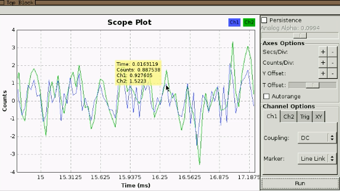
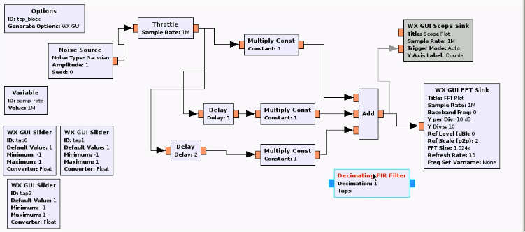
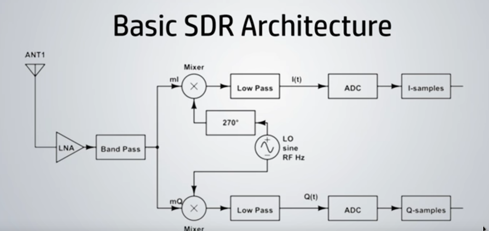
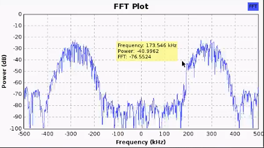
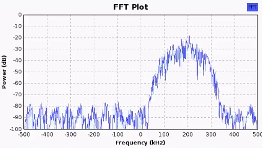

https://greatscottgadgets.com/sdr/10/

To convert all the blocks to float, select them and hit the down arrow.

We see that by adding a delay block, and adding it, we begin to notice a filtering effect.

This reminds me of the chapter on recursive filters from *The Scientist and Engineer's Guide to
Digital Signal Processing*.

By adding a delay block, we're adding delay, but we're also removing some high frequency content (compare green and blue lines):

The filter being assembled in this lesson, is actually called a `Decimating FIR Filter`:

If we keep decimation to 1, and enter into taps `(1, 1, 1)`, get an equivalent filter to what what was assembled.

The `Low Pass Filter` block is also an `FIR Filter`, but instead of specifying the value of the taps, we specify a `Cutoff Freq` and `Transition Width`. It will determine the filter values. See line 203 of homework: `self.low_pass_filter_0.set_taps(firdes.low_pass(1, self.samp_rate, self.samp_rate/8, self.samp_rate/8, firdes.WIN_HAMMING, 6.76))`

When cuttoff and transition width is very low is because in order to achieve such a sharp transition, it needs to compute a large number of taps.

Even in analog filters, there's a trade-off between (the sharpness of the cutoff frequency and transition width) and (the cost and size of the circuitry).

The *bandwidth* parameter on the HackRF is the configuration of the analog baseband filter in the circuitry. It can be tweaked using the osmocom block settings. Can also change gain settings, etc.:

The narrowest bandwidth settings with HackRF is 1.75M. The widest is higher than the allowed sample rate (20M samples/second).

For a bandpass filter, if we change the FIR type to be from `Complex -> Complex (Real Taps)` to `Complex -> Complex (Complex Taps)`, we can get a bandpass filter that doesn't mirror image:

Before:

After:

FIR filters are popular becuse they're efficient, but they're not the only types of filters.

Under the hood, GNU Radio optimizes FIR filters using the GPU.
