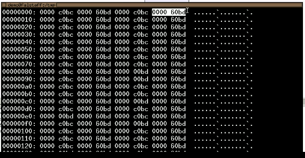
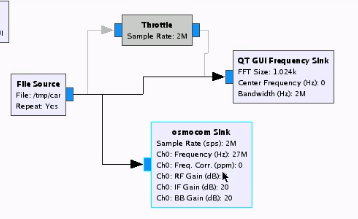
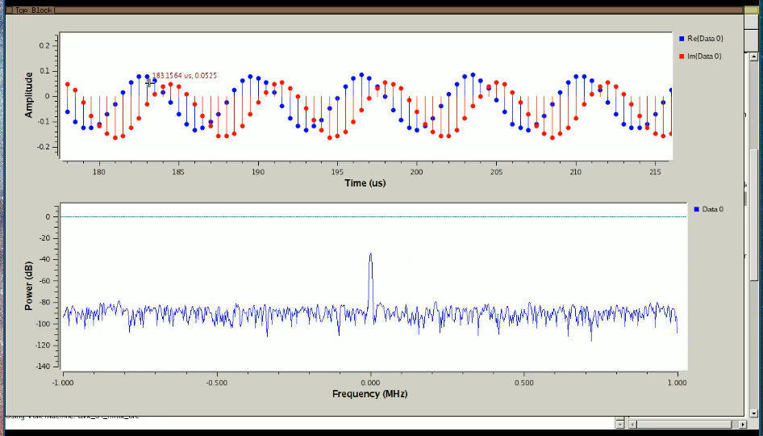
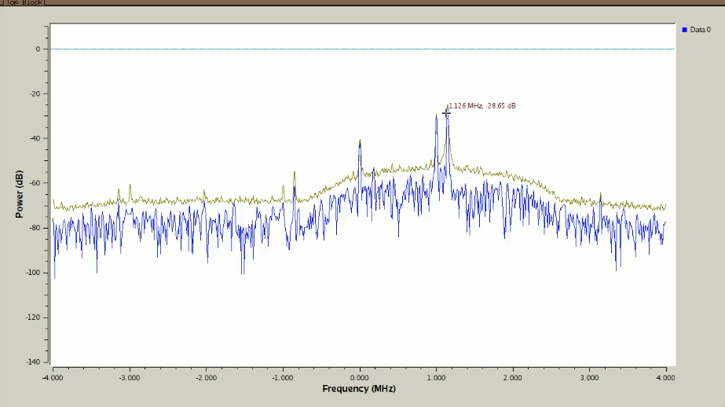
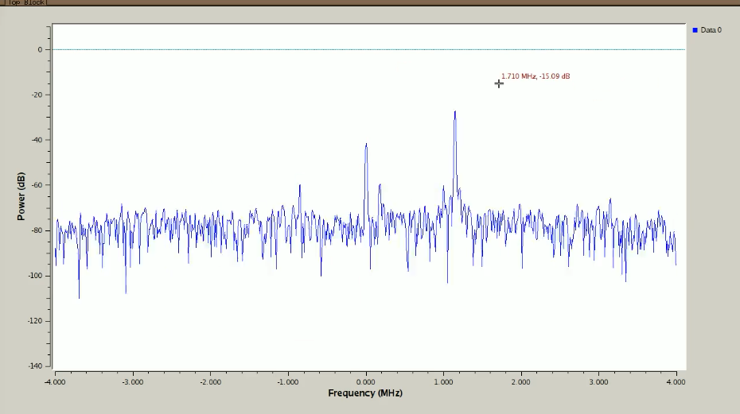
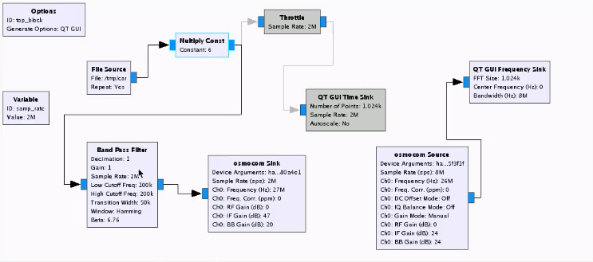

https://greatscottgadgets.com/sdr/11/

There exists Amateur Radio Licenses to gain privilege to transmit on certain frequencies.

ISM bands (2.4Ghz) and industrial, scientic and medical bands are license free.

It is extremely easy to jam a GPS receiver because the signal comes from such distance (satellites) that it becomes weak.

Operating inside a shielded enclosure (Faraday cage) blocks transmissions. A discarded microwave can be used as one (they are designed to shield 2.4 Ghz waves).

Avoid transmitting too much power, and jamming other receivers.

When testing, a good strategy is to connect the receiver with the transmitter using a coaxial cable instead of doing it wirelessly. Be sure to put at leaste a 20 dB attenuator at the end of the cable. This will mimic wireless transmission well.

Just going from two antennas touching to two antennas seperated by a bit of air gives about 30 dB of attenuation.

Operating a transmitter or receiver without a dummy load can be unsafe for the device.

When you transmit on a certain frequency, sometimes you may have unintended weaker spurs on different frequencies. It is important to be aware of that to be good neighbor on the radio spectrum.

Be very careful with the laws if you attach an amplifier to a transmitter.

Middle clicking a `QT GUI Frequency Sink` gives options to work on the plot.

You can use a `File Sink` block to save the output of a block to a file. Useful for performing a replay. If you attach it to an `osmocom source`, you get a file whose output consists of concatenated floating point numbers, which are 4 bytes (can do a hexdump with `xxd` to read it). This serial is the encoding I, Q, I, Q, etc:

Could then use a file source to replay the data, and then use an `osmocom sink` block to transmit the output of the file.

Note: no need to throttle in the following graph because the `osmocom sink` block is already throttled internally, so the output of file source will be consumed at the same rate in the `QT GUI Frequency Sink`, as in the osmocom sink:

`inspectrum` is a good tool to quickly get the waterfall image of a file.

Note that the amplitude values can go from -1 to 1. In this example, the recorded data goes only from -0.1 to 0.1:

So, we might as well scale it before sending it to the `osmocom sink` block for transmission. Do this by using a `multiply` block.

Good to use a second hackRF and an `osmocom source` block to see what you're transmitting as you transmit it. In an `osmocom source` or `osmocom sink`, you can enter a device argument like `hackrf=2f80a4e1` (get serial using `hackrf_info`) to specify what hackRF to use for that block.

We do some bandpass filtering before retransmitting to filter out the noise and fragments produced by the hackRF when receiving.

Before:

After:

Final circuit:

