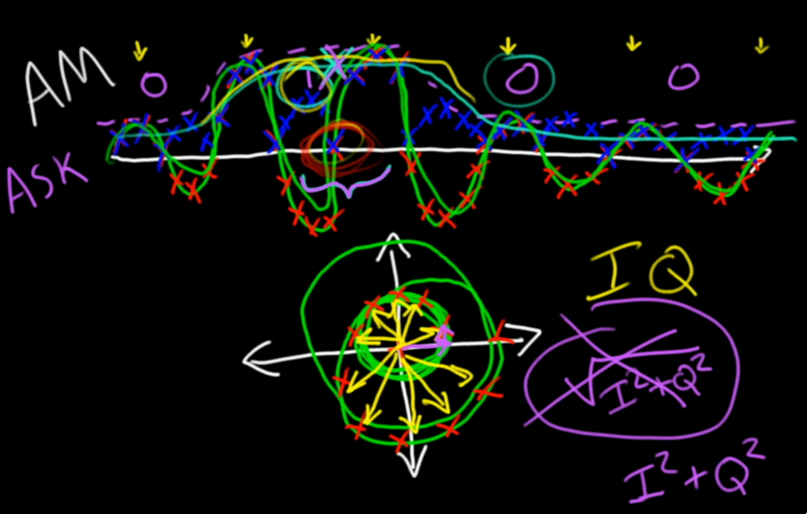
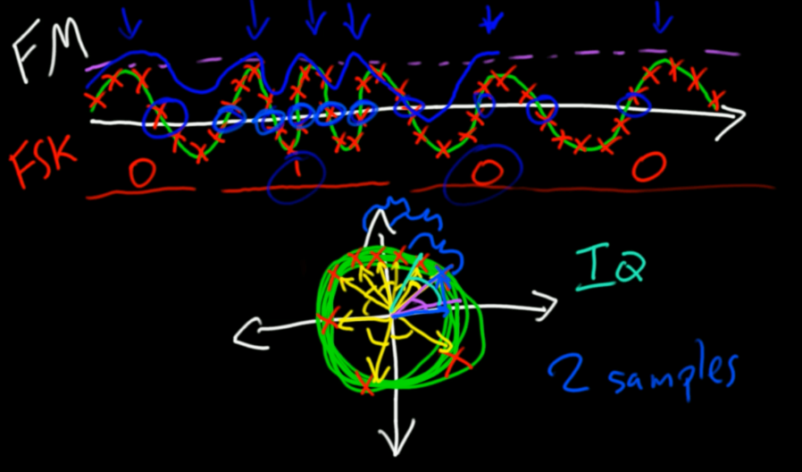

https://greatscottgadgets.com/sdr/7/

ASK: Amplitude shift keying. Amplitude to encode data.

The block called AM Demod in GNU Radio implements the method for amplitude demodulation presented in the video. It takes a complex input and produces real-valued (float) output where each output sample is the magnitude of an input sample.

FSK: Frequency shift keying. Frequency to encode data.

The block called Quadrature Demod in GNU Radio implements the method for frequency demodulation presented in the video. Notice that it takes complex input and produces real-valued (float) output which is a sequence of angles.

* note: the second drawings are the helix view.

