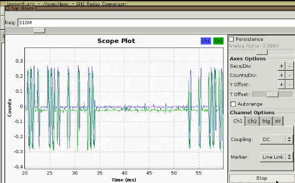
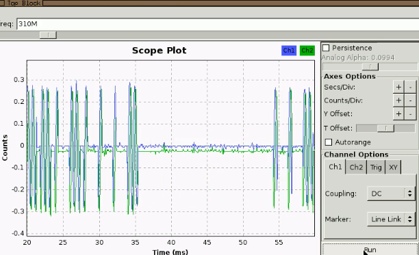
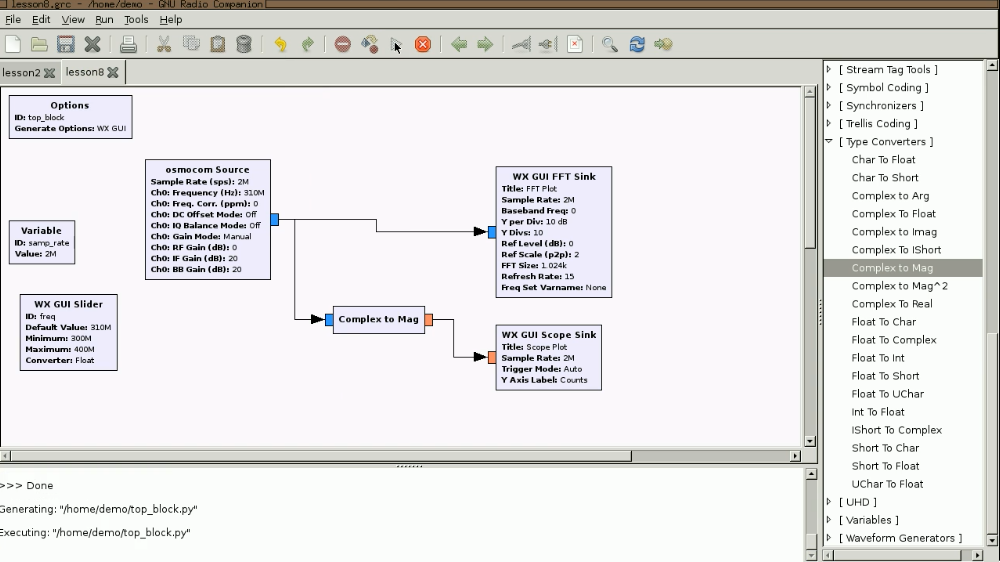
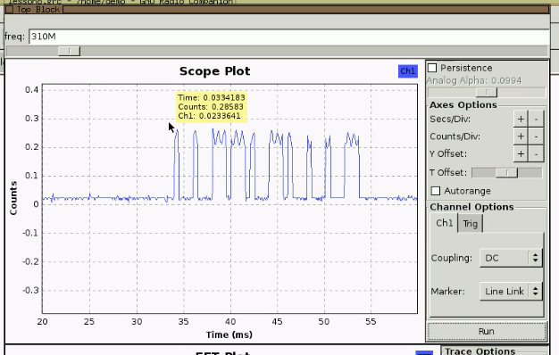

https://greatscottgadgets.com/sdr/8/

Find equipment information:

https://fcc.io

On-off keying: simplest form of amplitude modulation. The transmission is either completely on or completely off. It's like morse code (CW transmission).

Looking at the signal in time division:

Looking at magnitude in time division:

