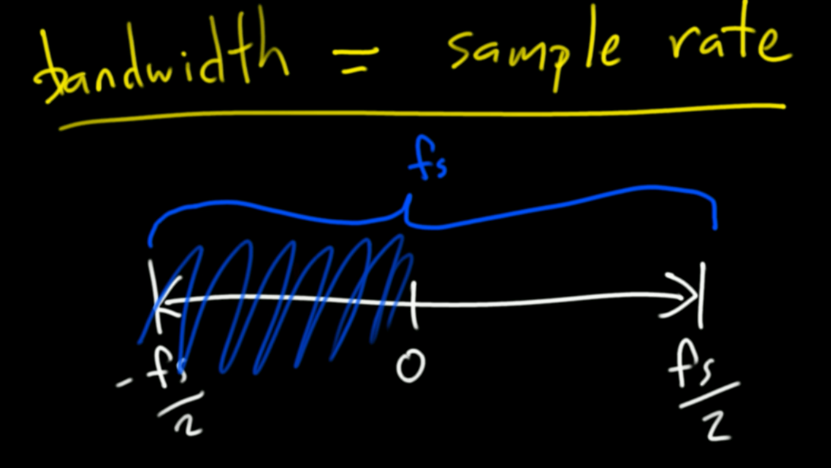

`osmocom_fft`: good command for looking around for an unknown signal.

2-FSK (one frequency represents a 1, another 0):

Using the Quadrature Demod block discussed in lesson 7, we get the binary output:

Ways to express frequency:
- Radians per sample (in the unit circle, how fast it moves around the unit circle)
- kHz by doing sample rate / samples per period

Signal with a negative frequency is one that progresses in the opposite direction around the unit circle. Note a negative frequency like -tau/8 could be expressed as 7*tau/8, so f = f + n * tau.

The signal source block in GNU radio says `Waveform: Cosine`, but really the output is a complex exponential. You can see this if you click the `scope plot` option in the WX GUI block.

(it's rotating around the complex plane over time)

To get a true cosine wave, switch the output of the blocks to float.

FFT of a regular cosine wave:

We can see that a cosine is made up of two complex exponentials with magnitude 0.5. If we add up the positive theta (green) and negative theta (red) components, on the real axis, there's a cosine wave projected (blue):

In fact, this addition is what the DFT formula is doing:

Aliasing: Atari effect (the wrap around effect, when the spike reaches the tip on the fft plot, it wraps around). This happens because the frequency domain is periodic.

Sampling Theorem (or nyquist-shannon theorem):

f_sampling > 2 * f_interest

Or, another way to say it:

bandwidth = sample rate

